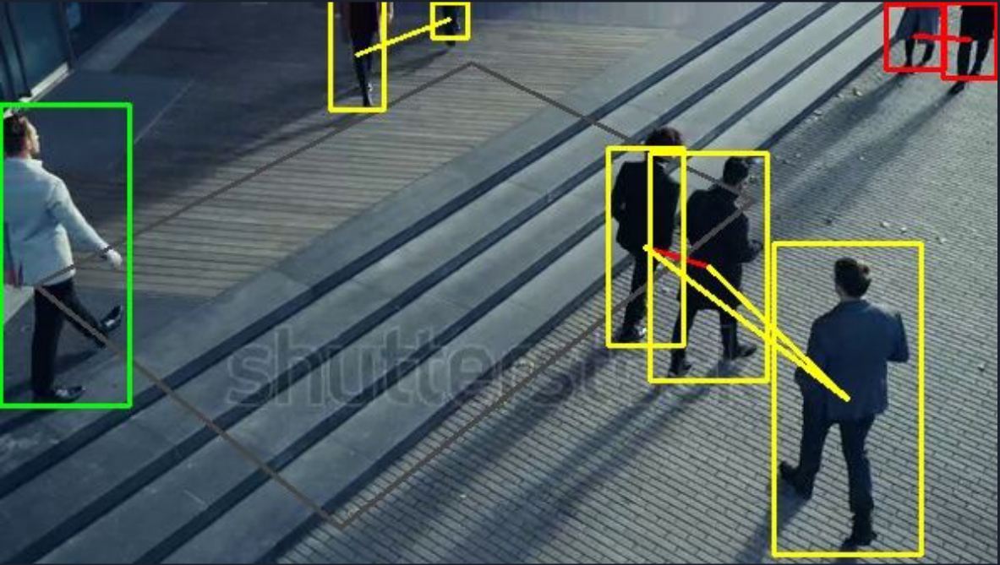

[Back to Home](../)

# 
Projects

Throughout my academic journey, I've developed many projects in different fields of Computer Science. Most of them were course final projects, but I've always tried to create them the best way possible. Here I'll briefly explain some selected projects in no particular order.

### 
Elevator Controller System

This was the final project for the "Embedded and Real Time Systems" course. Here we were assigned to design an elevator controller system that was supposed to control an actual elevator with multiple floors and different considerations. Everything in this project (except the simulation) was done via MATLAB Simulink.

We started by writing the requirements of this system. We had many considerations, including:
Pushing an irrelevant button while moving (doors closed).
Queuing the pressed floor buttons.
Elevator velocity management.
, etc.

After that, we made the system's model composed of different sub-modules like button handler, velocity handler, and floor management. To ensure the systems are functioning well and have no failure points, we wrote unit tests for every unit available in the system's program.

Then, we simulated the whole project on an Arduino board. Since we didn't have access to the physical boards, we used the [TinkerCAD](https://www.tinkercad.com/) website.

**Keywords:** Embedded Systems, Arduino, MATLAB, MATLAB Simulink, TinkerCAD

### 
Social Distancing Detector

This was the final project for the "Fundamentals of Computer Vision" course. The course professor didn't specify the subject of the project, and we had to choose an area of Computer Vision ourselves. After thinking about various problems, we came up with a system that eventually tried to identify the distance between people and alert when many people were close to each other.

The task consisted of two main sections. First, we needed to identify the "Person" object in the images, and then we had to project the camera space to find the actual distances. For safety measures, the system was sensitive to distances more than 2 meters.

We tried several Deep Learning models such as YOLO (and its variants), R-CNN (and its variants), and SSD for the person identification part. In need of faster inference time, we chose YOLOv3.

After identifying individuals in input images, we had to understand the distance between each one of them. Since the camera is almost always angled, we must understand how the input image gets mapped to the real-life scene. To do so, we changed our point of view in the "bird's eye view." The only necessary processing was to know where the coordinations of the input image were. To do that, the user must input 7 points before the program starts: 4 of those are the 4 points of the rectangle in which people are walking. The other 3 demonstrate the distance between points, they should make a right-angled triangle, and each of the right-angled sides should be around 1 meter.

Here is an example of our system in action:

### 
AI-bot Contest

In Feb 2021, [AI-bot](ai-bot.ir) was held nationwide. The goal was to create a virtual assistant (like Google Assistant or Amazon Alexa) with a much more constrained problem space. The system had to answer questions in only four types: Time, Date, Calendar Occasions, and Religious Times. Three of my friend and I participated in the contest, and our final model achieved 76% accuracy (ranked 6th) in answering the questions.

The problem had multiple parts. Here is the general flow of the system: 

1. Identify the type of question   We treated the task as a text classification one and used a combination of an LSTM model and rule-based processing. For instance, if we saw the work "ساعت" (meaning "clock, watch" in English), this question had more chance belonging to the Time group.

2. Extract the name entities such as cities or events   This was done with a "Name Entity Recognition" model based on the BERT model and fine-tuned for the Persian language.

3. Finding the answer   After finding all the information needed using the steps mentioned above, we extracted the required information (the calendar event of one specific day, for example) through provided APIs using Python scripts.

4. Finalizing the result   To provide a basis for comparing all the participants, we had to give answers within a specific format made up of the type of the answer, the entities, and the answer itself. After submitting the solution, a 0/1 grade would be assigned to each answer, which made up the accuracy score.

### 
Study of Path Finding Algorithms on E-puck Robots

This was the final project for the "Fundamentals of Robotics" course. In this course, we were introduced to the "Bug" family of pathfinding algorithms. We were asked to implement and compare the Bug0, Bug1, and Bug2 algorithms in the final project. After that, we had to implement another algorithm chosen from [this paper](https://arxiv.org/abs/1808.05050).

First off, I needed to get more familiar with the We-bots simulation application. After reading its documentation and knowing what each sensor or actuator does, I had a good grasp of the whole thing. Next, the algorithm implementation began; I wrote all four algorithms in Python and tested them with various scenarios/environments. Then I compared the algorithms and wrote each one's advantages or disadvantages in each specific scenario.

After completing this part, we were asked to manipulate the robot's kinematic model. We had to add gaussian noise to the robot's wheels based on their rotation and compare the results again. The goal of this section was to emphasize the additive error in the wheels by adding more barriers to the environment.

For the last step, we had to compare two localization methods: GPS and localization through odometry, which was an easy part.

### 
BitTorrent-similar Network

This was the final project for the "Computer Networks" course. Here we had to implement and test a P2P network like BitTorrent. Each node in this network had first to contact the tracker to exchange essential information and then start transferring the packets. We chose Python for our programming language, and since we were simulating a network, all connections were established via sockets. There was an extra grade for implementing large files and sending/receiving files simultaneously, which we implemented.

Each node was able to do three actions: Upload, Download, and Exit. Of course, before actually transferring the packets, each node had to contact the tracker to understand the current state of the network. After telling the tracker, each node is added to either the "owners" list (the ones uploading files) or is considered a receiver node.

After getting the "owners" list, the receiver node finds out the size of its requested file and begins its transfer. Each of the uploaders in the list will upload some portion of that file to the receiver. Each of them is done in a thread. After every thread is done, the file is glued together and saved.
