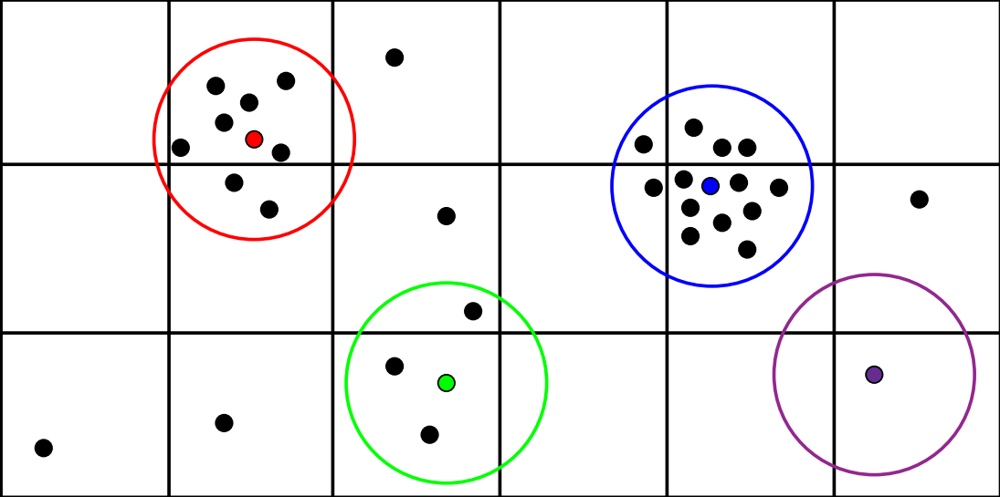

I'm a Computer Engineering student at [Shahid Beheshti University](https://www.sbu.ac.ir/), Tehran, Iran. I started my AI journey in 2019 with great enthusiasm for this field ever since. I've managed to apply my knowledge to both academic and industrial scenes as I'm currently **Research Assistant** in [Institute for Research in Fundamental Sciences (IPM)](http://www.ipm.ac.ir/) (Computer Science department) and **Data Scientist** in [Digikala](www.digikala.com).

This website acts as a detailed version of [my CV](https://github.com/mhezarei/mhezarei.github.io/CV.pdf) where I explain my academic career and projects.

# Research

For as long as I remember, I've always had a catch for developing ideas and finding innovative ways to solve existing problems. Until now, I've taken part in 3 different publications, explained below.

### **1. Fault Prediction in Competitive Programming Codes**

There exists a lot of publications in which the authors tried to predict or analyze the faulty (buggy) areas in some projects. The scope of these fault-detectors were bounded to the modules. Our idea originally was to create a system capable of identifying and reporting the faulty areas of a program using the **line-level** features.

Of course focusing the live-level features in a project as a whole is really difficult and that was why we focused our attention to a specific type of programs. Those written in only one file. Since there was no dataset available at the time (or at least we didn't find any), we were compelled to create our own dataset and that's where we chose the programs submitted to the [CodeForces](http://codeforces.com) website.

Our objective was to find faulty areas of a program and crawling every program in that website wouldn't help at all. That's why we only looked for programs which were **Accepted** by changing only a few lines. Yes! That was where the faults occurred.

The dataset was made up of pairs of programs, one program in each pair was the **Wrong Answer** and the other one was the **Accepted** version. Around 96,000 programs were gathered which each of their lines labeled as either "False" (where the line wasn't faulty), and "True" (where the line was buggy).

Different features were then extract from the programs to build up the final dataset. Both semantical features and program-specific features (such as number of operands in each line) were considered.

Finally, different machine learning models were used to predict the faulty areas in different/new programs and the best model achieved **76% accuracy**.

### **2. Scalable Kernel Load-Balancing for Parallel SPH simulation**

The [Smoothed Particle Hydrodynamics](https://en.wikipedia.org/wiki/Smoothed-particle_hydrodynamics) is a method which tries to simulate the fluid flows and observe their behavior. Typically, a scenario is defined to help the simulation progress. One common scenario is called the "Dam Break" in which a fluid is kept behind a dam and released in order to start the simulation. Factors like fluid density, gravity, particle weight, etc control the simulation.

Since SPH is a "meshfree" method, no pre-defined connection is required between the particles. This is what makes Graphics Processing Units (GPUs) one of the best environments to run the simulation on since every particle can be mapped to a thread. Most of the researches at the time were focused on how to load-balance the simulation when ran on multiple GPUs and none (at least to our knowledge) focused on load-balancing in the thread-level. That's what made our work unique.

The problem with high-level load-balancing was that most of the time, particles were much more dense in some areas than the others and this made the workload unequivalently distributed among the threads. Therefore, some threads were doing a lot of work (the ones with a lot of neighbors), some weren't doing much work or even not at all. For example in the picture below, the blue particle is doing 4x work compared to the green particle.



Our proposed method focused on distributing the workload equivalently among all the threads at each step. We showed that the computation overhead occurring at each step is negligible compared to the achieved performance gain. We also showed the potential of this method as many multi-GPU simulation frameworks could benefit from this new method of load-balancing.

We evaluated our model on NVIDIA GeForce RTX 2080 Ti for a dam break scenario of 1M particles where we gained 73% performance improvement over the baseline (with dynamic load-balance).

# Markdown

Markdown is a lightweight and easy-to-use syntax for styling your writing. It includes conventions for

```markdown
Syntax highlighted code block

# Header 1
## Header 2
### Header 3

- Bulleted
- List

1. Numbered
2. List

**Bold** and _Italic_ and `Code` text

[Link](url) and 
```

For more details see [GitHub Flavored Markdown](https://guides.github.com/features/mastering-markdown/).

### Jekyll Themes

Your Pages site will use the layout and styles from the Jekyll theme you have selected in your [repository settings](https://github.com/mhezarei/mhezarei.github.io/settings/pages). The name of this theme is saved in the Jekyll `_config.yml` configuration file.

### Support or Contact

Having trouble with Pages? Check out our [documentation](https://docs.github.com/categories/github-pages-basics/) or [contact support](https://support.github.com/contact) and we’ll help you sort it out.
